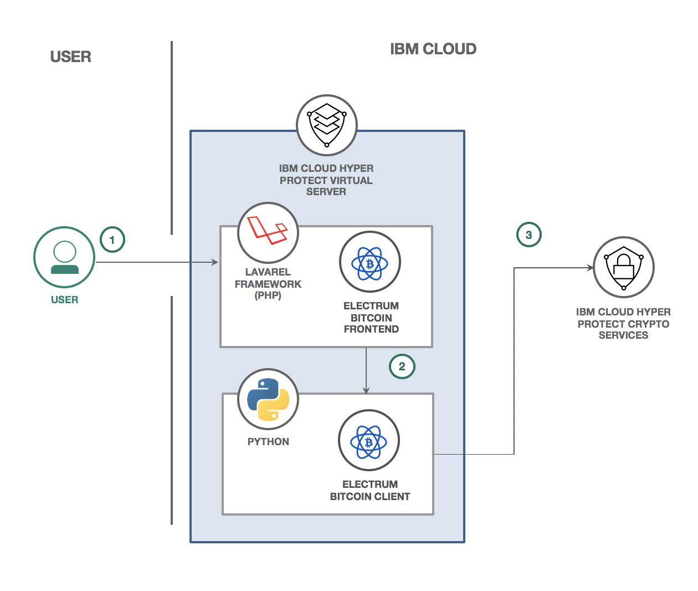

Title: Securing a Digital Wallet in the Public Cloud

Summary:
In this code pattern, learn how to deploy a Digital Wallet application with a Web Frontend and an Electrum Bitcoin Client in an IBM Cloud Hyper Protect Virtual Server using [Electrum 3.3.6](https://github.com/spesmilo/electrum/tree/3.3.6). The application will be deployed in an IBM Cloud Hyper Protect Virtual Server while integrating with IBM Cloud Hyper Protect Crypto Services to encrypt the Bitcoin wallet. This integration is optional - but adds another layer of security.

Description:
Cryptocurrencies, such as bitcoin, require top level protection as hackers look to steal these digital assets. Digital wallets need to be secure to keep the currency safe. In this example, we can create a digital wallet deployed in the public cloud for easy access while still maintaining high security with IBM Cloud Hyper Protect Services.

To start, we'll create an IBM Cloud Hyper Protect Virtual Server
instance, which requires a generated SSH key pair to ensure only the user has access to the instance. We'll then build and deploy the python backend application. Finally, we'll build and deploy the Electrum Bitcoin application that uses Node.js to serve a static website employing jQuery to make requests to the python backend app. The result is a Digital Wallet application that can accept user info to access Bitcoin funds on the cloud. By running the application in an IBM Cloud Hyper Protect Virtual Server, we can ensure that the storage used by the applications is also encrypted. Additionally, with IBM Cloud Hyper Protect Crypto Services, we can ensure that the application itself is encrypted with keys stored in the tamper-proof HSM.

When you have completed this code pattern, you will understand how to:

- Build and run a Etherum Bitcoin digital wallet application
- Stand up an IBM Cloud Hyper Protect Virtual Server
- (Optional) Integrate with IBM Cloud Hyper Protect Crypto Services to encrypt the wallet

Flow:

Instructions:

Find detailed steps for this pattern in the [README file](./README.md).
