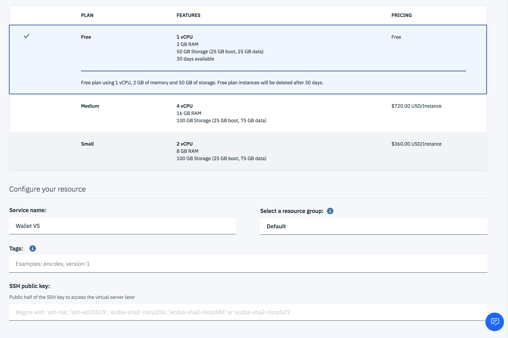

# Bitcoin Digital Wallet

In this code pattern, we will deploy a Digital Wallet application in the public cloud. As digital wallets are targeted by hackers, it is important that the digital assets be protected in an environment that is also easily accessible by the user - also known as a "hot wallet". This includes having an environment where neither privileged admins nor external threats can compromise the data, via encryption and other mechanisms.

The Digital Wallet application consists of an Electrum Bitcoin Client backend and a Web frontend.
The backend, a modified version of [Electrum](https://github.com/spesmilo/electrum), runs as a JSON RPC server to maintain a bitcoin wallet by interacting with the bitcoin network. 
The frontend, a modified version of [Electrum for Laravel 5.4+](https://github.com/AraneaDev/laravel-electrum), runs as a Web frontend on [Laravel](https://laravel.com/) to interact with bitcoin users via a Web browser. Laravel hosts an application written in PHP using
Node.js for the rendering on the client (browser).

These two components are configured to run in a single [IBM Hyper Protect Virtual Server](https://cloud.ibm.com/catalog/services/hyper-protect-virtual-server), as illustrated in the following diagram. It can optionally encrypt/decrypt a wallet file using [IBM Cloud Hyper Protect Crypto Services](https://cloud.ibm.com/catalog/services/hyper-protect-crypto-services) (zHSM) to protect the encryption key. 


When you have completed this code pattern, you will understand how to:

* Build and run an Electrum Bitcoin Digital Wallet application 
* Stand up an IBM Cloud Hyper Protect Virtual Server
* (Optional) Integrate with IBM Cloud Hyper Protect Crypto Services to encrypt the wallet


## Steps

The frontend and backend applications can both be run locally, or on a Linux VM in the IBM Cloud,
for example an [IBM Cloud Hyper Protect Virtual Server](https://cloud.ibm.com/catalog/services/hyper-protect-virtual-server).




### Create your IBM Cloud Hyper Protect Virtual Server Instance

You can find the instructions [here](https://cloud.ibm.com/docs/services/hp-virtual-servers?topic=hp-virtual-servers-provision).

Make sure to copy and paste in your SSH public key. If you don't have one already, please follow the guide [here]( https://cloud.ibm.com/docs/vpc?topic=vpc-ssh-keys).

### Log into your Virtual Server

You can find the instructions [here](https://cloud.ibm.com/docs/services/hp-virtual-servers?topic=hp-virtual-servers-connect_vs).

### How to build the Wallet application

Start by installing Git and Docker. You typically need a root privilege. If you login as a root, typically you find `#`
as a command line prompt. You can run the following two commands to install Git and Docker.

```
# apt-get update
# apt-get install -y git docker.io
```

If you login as a regular user, typically you need to use `sudo` command to install them.

```
$ sudo apt-get update
$ sudo apt-get install -y git docker.io
```

To build the application, clone the master branch from this repo and build a container out of it.
If you just installed Docker in the VM, and if you want to build a container as a regular user,
typically you need to add your userid to the `docker` group. 

```
$ git clone https://github.com/IBM/secure-bitcoin-wallet.git
$ cd secure-bitcoin-wallet
$ docker build -t secure-bitcoin-wallet .
```

By default, the Dockerfile installs grpc python packages, such as `grpcio-tools`, to access IBM Cloud Hyper Protect Crypto Services (HPCS).
Since this step can take some time and resources (e.g. memory), you can skip it by adding `NO_GRPC_BUILD=1` as a build argument.
This option allows you to build a container on a small VM, such as a free instance of HPVS, 
if you are not planning to use HPCS.

```
$ docker build --build-arg NO_GRPC_BUILD=1 -t secure-bitcoin-wallet .
```

### How to run the application

The following sequence of commands starts a wallet container for the Bitcoin `testnet`, where bitcoins don't have an actual monetary value.
If you run multiple wallet instances on the same VM, the *WALLET_NAME* and *PORT* should be unique among wallets in the VM. The container uses a Docker volume of *WALLET_NAME* to store a wallet file.


```
$ WALLET_NAME=<wallet-name> (e.g. alice)
$ PORT=<external-https-port>
$ docker run -d -v ${WALLET_NAME}:/data -p ${PORT}:443 --name ${WALLET_NAME}-wallet secure-bitcoin-wallet
```

Alternatively, you can use the following shell script in the `scripts` directory. Docker selects an unused port as a default, except for a few predefined wallet names (e.g. charlie for 4431, devil for 4432, eddy for 4433). The script prints the port number assgined to the wallet if a container is created successfully.

```
$ ./scripts/run-wallet.sh ${WALLET_NAME}
a wallet is running in container ${WALLET_NAME}-wallet at port xxxxx
```

### How to encrypt the wallet with HPCS (optional)

Optionally, you can use an HPCS instance to encrypt/decrypt a wallet. To use an HPCS on IBM Cloud, you need to supply the following four parameters.

- ZHSM: the domain name and the port number of the HPCS instance (e.g. ep11.{location}.hs-crypto.cloud.ibm.com:1234)
- APIKEY: the api key for the HPCS instance (e.g. xxxxxxx-xxxx-xxxxxxxxxxxxxxxxxxxxxxxxxxxxxxx)
- INSTANCE_ID: the instance id of the HPCS instance (e.g. xxxxxxxx-xxxx-xxxx-xxxx-xxxxxxxxxxxx)
- IAM_ENDPOINT: the URL of an IAM endpoint (this is optional. a default value, https://iam.cloud.ibm.com, is used if not specified)

If `ZHSM` is not defined, a default software AES is used.
If `ZHSM` is defined but `APIKEY` or `INSTANCE_ID` is not, we assume the HPCS instance doesn't require authentication
(typical for an on-prem instance).

```
$ docker run -d -v ${WALLET_NAME}:/data -p ${PORT}:443 -e ZHSM=${ZHSM} -e APIKEY=${APIKEY} -e INSTANCE_ID=${INSTANCE_ID} --name ${WALLET_NAME}-wallet secure-bitcoin-wallet
```

### Use a Web browser to access the electrum wallet.

- Access https://hostname:port/electrum from a browser with the port number specified for the container.
- Accept a warning on a browser to use a self-signed certificate.
- Click "register" to register name, e-mail address, and password, for the first time. Or click "login" if already registered.
- Access https://hostname:port/electrum again if not redirected automatically.
- Create and load a wallet from a Wallet tab. Leave the seed field empty unless you want to use a seed from a previously created wallet. You can set a wallet password here. Note that it is different from the login password.
- Reload the browser.
- Select one of five tabs (`History`, `Requests`, `Receive`, `Send`, or `Sign`) to interact with the wallet.

Here is a sample screenshot of the wallet to send bitcoins to a recipient.


### WARNING: This software is for demonstration purposes only. Use at your own risk.


### Additional note

1. Persistent data

A wallet file is stored in a Docker volume, which can be examined by the following command, as the volume name
is ${WALLET_NAME} when a wallet container is created as described above.

```
$ docker volume inspect ${WALLET_NAME}
```

2. Reloading an existing wallet

To load a previously created wallet with a password in a docker volume, run the following command to create a wallet container.
Replace [wallet-password] with your wallet password.

```
$ docker run -d -v ${WALLET_NAME}:/data -e WALLET=/data/electrum/testnet/wallets/default_wallet -e PASSWORD=[wallet-password] -p ${PORT}:443 --name ${WALLET_NAME}-wallet secure-bitcoin-wallet
```

## License

[Apache 2.0](https://github.com/IBM/secure-bitcoin-wallet/blob/master/LICENSE)

## Contributor License Agreement (CLA)

To contribute to the secure-bitcoin-wallet project, it is required to sign the 
[individual CLA form](https://gist.github.com/moriohara/9926f0791f1168acd7974b9dc4467e99) 
if you're contributing as an individual, or 
[corporate CLA form](https://gist.github.com/moriohara/018efe7c8b3247da3e77ddbf56f55c2e) 
if you're contributing as part of your job.

You are only required to do this once at on-line with [cla-assistant](https://github.com/cla-assistant/cla-assistant) when a PR is created, and then you are free to contribute to the secure-bitcoin-wallet project.
